# Graduate Capstone Project Manuscript

---

## Chapter 1. Introduction

### 1.1 Background

Warehouses combine pedestrians, forklifts, storage racks, and material-handling equipment in a shared, fast-paced environment. While safety training and protocols reduce operational risk, they cannot eliminate human error. Pedestrians occasionally step outside marked walkways, and forklifts may travel too fast near workers. Traditional safety oversight—direct supervision, periodic audits, and manual video review—is retrospective and cannot provide continuous monitoring. Unsafe behaviors are often recognized only after a near-miss or injury occurs.

Johnson & Johnson (J&J) sponsored this capstone project to investigate whether standard warehouse CCTV feeds could enable proactive safety monitoring by identifying observable risks before incidents happen. Early discussions with J&J's Environmental, Health, and Safety (EHS) and engineering teams identified vehicle speed and pedestrian-vehicle interactions as primary operational concerns.

The target behaviors were structured around J&J's Five Life-Saving Rules for vehicle and pedestrian safety:
1. **Rule 1:** Do not use mobile phones or distracting devices while operating equipment or walking in operational zones.
2. **Rule 2:** Complete a daily vehicle pre-use inspection record.
3. **Rule 3:** Maintain at least three vehicle lengths from an active vehicle unless recognition has been signaled.
4. **Rule 4:** Stay within designated walkways and marked crossings.
5. **Rule 5:** Keep the driver's body entirely inside the vehicle cab.

Rule 2 involves inspection paperwork or digital logs that are not verifiable via overhead cameras, so it was descoped. The remaining four rules depend on observable physical positions, spatial proximity, and body posture, making them suitable for computer vision.

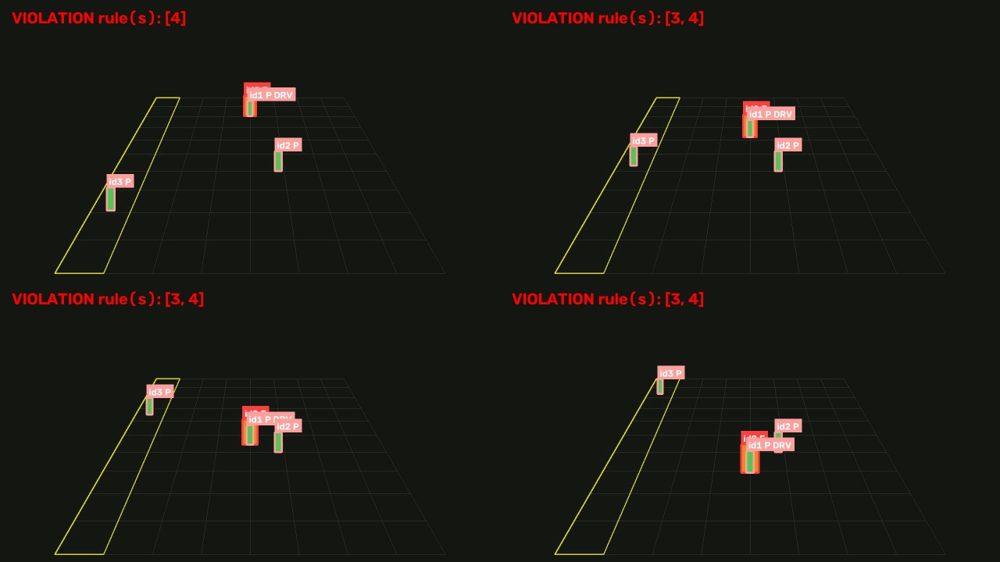

Our system uses a single modular perception pipeline rather than training individual end-to-end classifiers for each rule. RF-DETR detects people and forklifts, ByteTrack maintains consistent tracking IDs across frames, and RTMPose estimates body keypoints when posture analysis is required. Fixed-camera homography projects image coordinates onto the floor plane to calculate distances and speeds in real-world metric units. Deterministic rule functions then evaluate safety criteria on these calibrated measurements.

### 1.2 Problem Statement

The core engineering objective was converting raw CCTV video into explainable, structured safety event records. Standard object detection alone is insufficient: the system must also track entities through occlusions, estimate real-world ground velocity, measure physical separation distances, and apply duration thresholds to suppress transient noise.

Several constraints compounded this challenge:
- **Domain-Specific Objects:** Forklifts are not present in standard COCO pretrained models, requiring domain-specific fine-tuning.
- **Confidentiality:** Live J&J facility footage could not be exported to public clouds or third-party training pipelines. Development relied on public CCTV datasets and synthetic warehouse simulations.
- **Licensing Restrictions:** J&J requires a commercial deployment path in closed-source environments. Copyleft frameworks (such as Ultralytics YOLO under AGPL-3.0) were excluded in favor of permissively-licensed components (RF-DETR, ByteTrack, RTMPose under Apache-2.0).

The project evaluated whether a modular, permissively-licensed computer vision pipeline could reliably detect people and forklifts, calculate their spatial interactions on the warehouse floor, and generate auditable safety events.

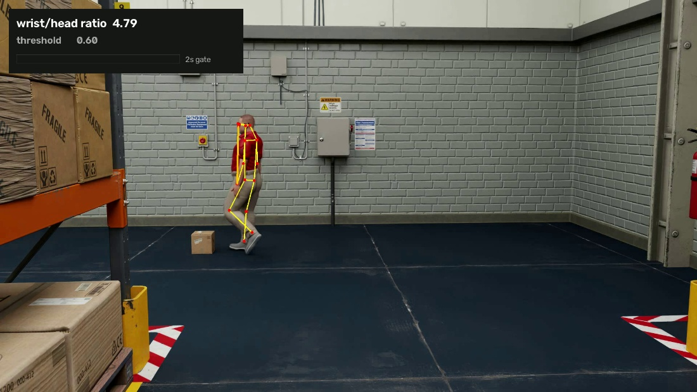

### 1.3 Project Objectives

The project set the following milestones:
- Fine-tune and benchmark an Apache-2.0 object detector for warehouse personnel and forklifts.
- Maintain persistent multi-object tracking IDs across frames to measure motion, dwell time, and interaction duration.
- Calibrate fixed cameras using planar homography to compute real-world metric distances and velocities.
- Implement explicit rule logic for Rule 3 (proximity), Rule 4 (walkway boundaries), Rule 5 (driver posture), and an exploratory proxy for Rule 1 (hand-to-head posture).
- Filter false alarms using temporal duration gates and motion hysteresis.
- Export structured JSON Lines event logs alongside face-anonymized evidence images.
- Validate the system against unit tests and empirical datasets, documenting all performance boundaries and limitations.

### 1.4 Scope and Boundaries

This project was an eight-week proof-of-concept developed by a five-person graduate engineering team to validate technical feasibility. It is not a certified industrial safety appliance and does not replace on-site EHS procedures.

The prototype processes single-camera recorded video streams. It covers object detection, multi-object tracking, optional pose estimation, camera homography calibration, metric distance/speed calculation, temporal rule gating, and anonymized evidence export. Rule 3 underwent extensive empirical validation. Rules 1 and 4 were implemented and unit-tested. Rule 5's geometric logic was verified via scenario matrices, though detector limitations on seated drivers prevented real-world end-to-end evaluation.

The project explicitly excluded live industrial camera integrations, automatic vehicle teleoperation or braking, multi-camera re-identification, biometric worker identification, and enterprise alert dispatching. A companion infrastructure demo illustrates containerized deployment with Docker, Kubernetes, Prometheus, and Grafana, but operates independently of the fine-tuned vision pipeline.

### 1.5 Engineering Significance

A key architectural contribution of this work is separating neural perception from deterministic rule evaluation. Rather than training a black-box model to predict whether a frame is "safe" or "unsafe," the neural models only detect visible entities and skeletal keypoints. Geometric and temporal rules then evaluate these physical quantities. This decoupling ensures that every flagged violation provides an explicit, auditable justification (e.g., "pedestrian was 5.2 m from forklift; threshold is 8.1 m"). Thresholds can be adjusted directly in configuration files without retraining models.

Planar homography calibration is essential for reliable distance evaluation. Perspective foreshortening distorts pixel distances; two bounding boxes separated by 200 pixels may represent 1 meter or 20 meters depending on camera depth. Projecting ground-contact points to floor-plane coordinates eliminates perspective ambiguity, enabling accurate metric proximity and speed estimation.

Multi-level validation also exposed critical failure modes that aggregate metrics obscure. While the fine-tuned detector achieved 0.820 mAP50:95 on real-world test data, targeted analysis revealed it missed 100% of seated forklift drivers because source datasets labeled only standing pedestrians. This finding highlights the necessity of scenario-specific validation beyond benchmark mAP scores.

### 1.6 Deliverables

The final project deliverables comprise:
- Fine-tuned RF-DETR model weights for person and forklift detection, along with data-curation scripts.
- An end-to-end execution pipeline integrating RF-DETR, ByteTrack, RTMPose, camera calibration, and safety rules.
- Rule engines for Rules 1, 3, 4, and 5 with centralized configuration schemas.
- Structured JSON Lines event logging and face-blurred visual evidence export.
- An automated test suite containing 91 passing unit and scenario tests.
- Comprehensive empirical evaluation reports detailing detection accuracy, spatial calibration error, and seated-driver limitations.
- Deployment, calibration, and reproducibility documentation.
- Containerized Kubernetes/Prometheus/Grafana demonstration manifests.

---

## Chapter 2. Background and Related Work

### 2.1 Industry and Technical Context

Computer vision applications in industrial safety rely on balancing inference accuracy with real-time throughput. Object detection models are commonly benchmarked on the COCO dataset using Mean Average Precision across IoU thresholds from 0.50 to 0.95 (mAP50:95) and at 0.50 (mAP50). Real-time industrial monitoring typically requires processing at 10 to 30 frames per second (FPS) with low latency.

#### 2.1.1 Architectural Paradigms: CNNs and Vision Transformers
Deep learning object detectors generally follow two paradigms:
- **Convolutional Neural Networks (CNNs):** Apply local convolutional filters to extract hierarchical spatial features. They are computationally efficient and well-suited for edge devices.
- **Vision Transformers (ViTs):** Partition images into patches, apply self-attention mechanisms, and capture global context across the entire frame. While traditionally more compute-intensive, recent architectures achieve real-time efficiency through optimized backbones and hybrid decoder designs.

#### 2.1.2 Model Quantization
To run efficiently on constrained edge hardware without dedicated enterprise GPUs, models can be quantized from 32-bit floating-point (FP32) to lower-precision formats like INT8 or FP16:
- **Post-Training Quantization (PTQ):** Quantizes weights and activation ranges after training using a representative calibration dataset.
- **Quantization-Aware Training (QAT):** Simulates quantization noise during training, allowing the network to adapt its weights and preserve accuracy at low bit-widths.

### 2.2 Existing Detection Architectures

#### 2.2.1 Two-Stage and Single-Stage Detectors
- **R-CNN Family:** Employs selective search or region proposal networks followed by feature classification. While accurate, two-stage detectors generally exhibit higher latency.
- **YOLO Series:** Formulates detection as a single-pass regression problem, predicting bounding boxes and class probabilities simultaneously. While offering strong throughput, recent versions maintained by Ultralytics are distributed under the copyleft AGPL-3.0 license.

#### 2.2.2 Real-Time Detection Transformers: RF-DETR
RF-DETR combines a Vision Transformer encoder, a DINOv2 backbone, and multi-scale deformable attention decoders to achieve state-of-the-art accuracy at real-time speeds. Crucially, its core model weights and reference implementations are released under the permissive Apache-2.0 license.

**Table 2.1: Object Detection Model Comparison**

| Model | COCO AP50:95 | Latency (ms) | Params (M) | License |
|-------|--------------|--------------|------------|---------|
| RF-DETR-N | 48.4 | 2.3 | 30.5 | Apache 2.0 |
| RF-DETR-S | 53.0 | 3.5 | 32.1 | Apache 2.0 |
| RF-DETR-M | 54.7 | 4.4 | 33.7 | Apache 2.0 |
| RF-DETR-L | 56.5 | 6.8 | 33.9 | Apache 2.0 |
| RF-DETR-XL | 58.6 | 11.5 | 126.4 | Commercial (PML 1.0) |
| RF-DETR-2XL | 60.1 | 17.2 | 126.9 | Commercial (PML 1.0) |
| YOLO26-N | 40.3 | 1.7 | 2.6 | AGPL-3.0 |
| YOLO26-S | 47.7 | 2.6 | 9.4 | AGPL-3.0 |
| YOLO26-M | 52.5 | 4.4 | 20.1 | AGPL-3.0 |
| YOLO26-L | 54.1 | 5.7 | 25.3 | AGPL-3.0 |
| YOLO26-X | 56.9 | 9.6 | 56.9 | AGPL-3.0 |

Because J&J requires a commercial integration path without copyleft obligations, RF-DETR was selected over YOLO.

### 2.3 Synthetic and Domain Datasets

Synthetic simulation environments provide scalable ground-truth annotations for rare safety events. NVIDIA's PhysicalAI SDG-Warehouse dataset contains over 120,000 synthetic clips depicting forklift collisions, pedestrian near-misses, and routine operations with exact camera projection matrices. This dataset provided benchmark ground truth for validating spatial calibration and geometric distance logic.

### 2.4 Domain Gap and Problem Formulation

Standard pretrained vision models do not include industrial equipment classes like forklifts. Moreover, safety compliance depends on spatial relationships, velocity vectors, and temporal persistence—capabilities that bounding-box detectors cannot provide in isolation. Fine-tuning a detector on warehouse assets and coupling it with deterministic spatial reasoning bridges this domain gap.

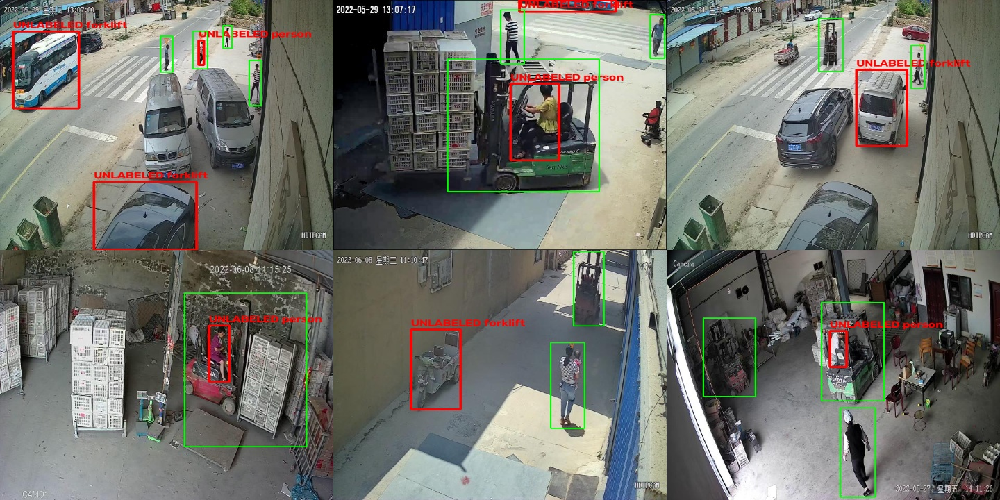

---

## Chapter 3. System Design and Methodology

### 3.1 Solution Architecture

The system pipeline executes in four sequential stages (Figure 3.1):

1. **Neural Perception:** RF-DETR (Apache-2.0) detects bounding boxes for persons and forklifts. In parallel, RTMPose extracts 17 standard COCO body keypoints per detected person via ONNX Runtime.
2. **Multi-Object Tracking:** ByteTrack associates bounding boxes across frames, maintaining consistent track IDs and estimating velocity vectors over a rolling temporal window.
3. **Planar Homography Calibration:** A camera-specific homography matrix projects the bottom-center of each bounding box (the ground-contact point) from image pixels to real-world floor coordinates in meters.
4. **Rule Evaluation and Event Serialization:** Deterministic functions evaluate metric distances, walkway polygon containment, and driver keypoint boundaries. Violations exceeding minimum temporal duration gates are logged to JSON Lines with anonymized evidence frames.

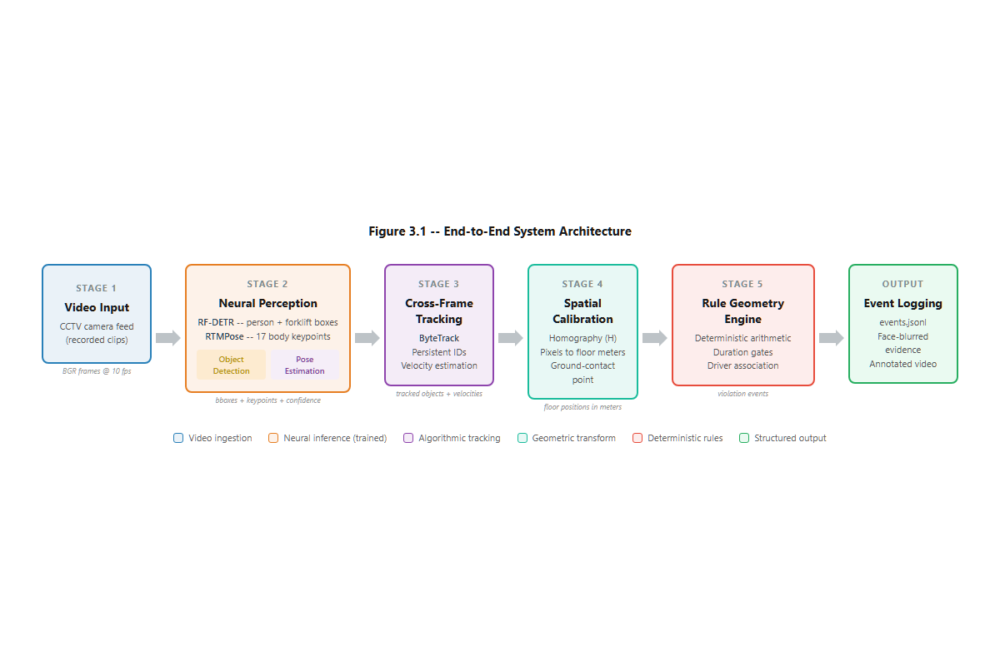

### 3.2 System Requirements

#### 3.2.1 Functional Requirements
- **Rule 3 (Proximity):** Calculate ground-plane Euclidean distance between non-driver pedestrians and moving vehicles. Flag a violation if the distance drops below a dynamic safety radius (3.0 vehicle lengths, approximately 8.1 meters for a standard 2.7-meter forklift).
- **Rule 5 (Driver Body Protrusion):** Define a cab inset region within the vehicle bounding box and trigger an alert if driver keypoints (wrists, shoulders, head) extend outside this zone for more than 1.5 seconds.
- **Rule 4 (Walkway Compliance):** Verify whether pedestrian floor positions remain outside designated walkway polygons for longer than 1.0 second.
- **Rule 1 (Distracting Device):** Calculate the ratio of wrist-to-head distance normalized by shoulder width, flagging sustained raised-hand postures (ratio < 0.60 for > 2.0 seconds).
- **Driver Association:** Associate a driver with a vehicle when their bounding box overlap exceeds 60% and their velocity vector matches within 0.5 m/s, preventing the driver from triggering Rule 3 false alarms.

#### 3.2.2 Non-Functional Requirements
- **Permissive Licensing:** All dependencies must use Apache-2.0 or MIT licenses to allow proprietary commercial deployment.
- **Throughput:** Maintain at least 10 FPS on standard workstation hardware.
- **Precision-First Design:** Prioritize high precision over recall to prevent alert fatigue from false positives.
- **Privacy by Design:** Apply automatic Gaussian face blurring on all exported evidence and use ephemeral track IDs that reset per session.

### 3.3 Rule Engine Design

Separating perception from rule logic provides three core advantages:
1. **Explainability:** Violation alerts provide concrete metric measurements (e.g., exact distance and threshold) rather than uninterpretable neural confidence scores.
2. **Configurability:** Safety thresholds, cab inset boundaries, and temporal gates can be modified via configuration files without retraining.
3. **Data Efficiency:** Training data is required only for standard object detection; rare violation configurations are verified algebraically.

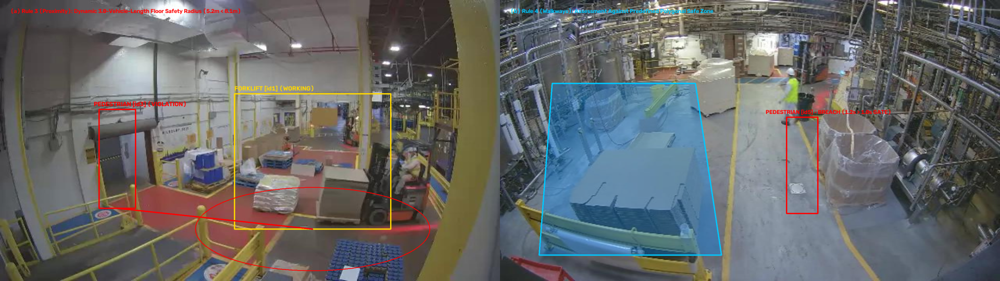

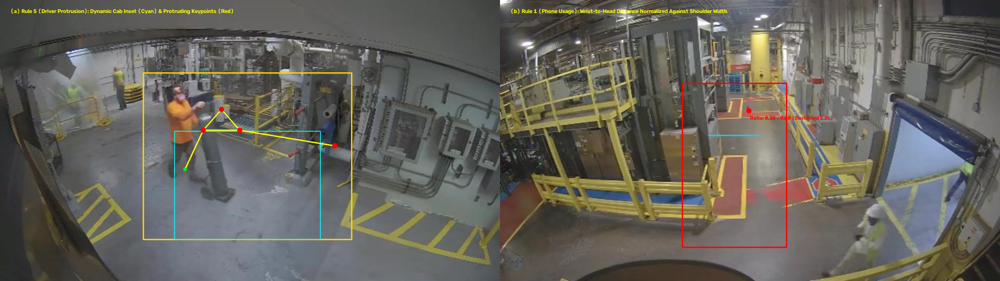

### 3.4 Development Methodology

Development followed a test-driven approach across four phases:
1. **Pipeline & Calibration Setup:** Implemented homography transformations and validated coordinate mapping against exact camera projection matrices from synthetic simulator scenes.
2. **Rule Implementation & Scenario Testing:** Built deterministic rule functions and verified edge cases using parameterized test matrices.
3. **Detector Fine-Tuning:** Ingested three public warehouse datasets from Roboflow Universe (CC BY 4.0) to fine-tune RF-DETR on real-world CCTV footage.
4. **Driver Fallback & Evaluation:** Implemented a region-of-interest (ROI) crop-and-pose fallback for seated drivers and evaluated the full pipeline.

### 3.5 Software Modules

The codebase is organized into modular Python components:
- **`detector.py`:** Manages RF-DETR inference, BGR-to-RGB conversion, FP16 execution, and confidence filtering.
- **`geometry.py`:** Encapsulates the `CameraGeometry` class for homography computation, point projection, polygon containment tests, and calibration checks.
- **`pose_utils.py`:** Wraps RTMPose under ONNX Runtime, supporting full-frame estimation and ROI cropped inference.
- **`rules.py`:** Implements deterministic rule logic, driver association, and motion state hysteresis.
- **`events.py`:** Manages temporal event aggregation, debouncing, and JSON Lines serialization with face-blurred visual evidence.
- **`run_pipeline.py`:** Coordinates video ingestion, perception, tracking, calibration, and output generation.

### 3.6 Verification Plan

Testing consists of two tiers:
- **Automated Unit Tests:** 91 automated tests cover coordinate math, motion tracking hysteresis, temporal debouncing, driver association, and rule edge cases without requiring GPU hardware.
- **Empirical Validation:** 178 synthetic clips from the SDG-Warehouse dataset benchmarked spatial accuracy and Rule 3 logic against ground truth. A dataset of 5,886 training images (4,553 real) and 1,387 validation images (667 real) benchmarked detection performance on CCTV feeds.

---

## Chapter 4. Results and Evaluation

### 4.1 Experimental Setup

#### 4.1.1 Hardware and Processing Configuration
The pipeline was evaluated on a workstation equipped with an NVIDIA GeForce RTX 3070 GPU and an Intel Core processor. Videos were processed at a fixed rate of 10 FPS to align with ByteTrack's kinematic model and temporal velocity estimation.

#### 4.1.2 Spatial Calibration Accuracy
Fixed cameras were calibrated using four ground control points mapped to real-world floor coordinates. The homography matrix $H$ was calculated via `cv2.findHomography`.

Calibration was validated across 178 synthetic camera views against ground-truth projection matrices:

| Metric | Value |
|--------|-------|
| Mean spatial error | 0.0000 m |
| Worst-case spatial error | 0.0001 m |
| Required tolerance | < 10% |

This sub-millimeter precision confirms that coordinate projection is mathematically exact. On physical installations, spatial accuracy is bounded solely by survey measurement quality.

#### 4.1.3 Object Detection Training Progression
RF-DETR was fine-tuned across three progressive dataset iterations:

**Table 4.1: Object Detection Training Progression**

| Model | Training Images | Validation Images | mAP50:95 | Forklift AP50:95 | Person AP50:95 | mAP50 | GPU Time |
|-------|----------------|-------------------|----------|-----------------|----------------|-------|----------|
| v1 (synthetic only) | 1,040 | 350 | 0.967 | 0.979 | 0.891 | 0.994 | 52.8 min |
| v2 (+ box pickup) | 2,053 | 720 | 0.962 | 0.973 | 0.896 | 0.985 | 100.3 min |
| **v3 (+ real CCTV)** | **5,886 (4,553 real)** | **1,387 (667 real)** | **0.820** | **0.830** | **0.777** | **0.968** | **221.9 min** |

The drop in mAP50:95 from 0.962 (v2) to 0.820 (v3) reflects the transition from synthetic validation to real-world CCTV validation data. Validation sets were partitioned strictly by video sequence to prevent visual data leakage between frames.

### 4.2 Empirical Results

#### 4.2.1 Object Detection Performance
The final v3 detector (`rfdetr_real`) achieved an overall mAP50:95 of 0.820 and mAP50 of 0.968, exceeding project acceptance thresholds (person $\ge 0.80$, forklift $\ge 0.60$ at mAP50). Figure 4.2 illustrates synthetic tracking and proximity evaluation, while Figure 4.9 demonstrates generalization across six distinct real-world warehouse camera angles.

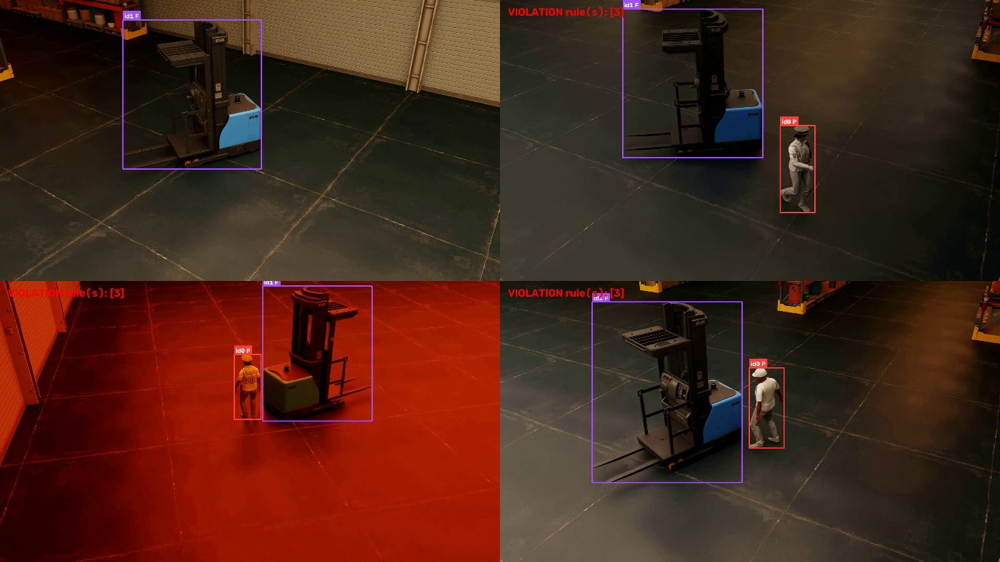

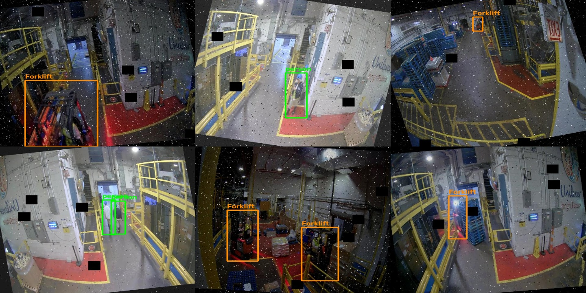

#### 4.2.2 Motion State and Driver Association
A forklift is classified as "working" if its floor speed exceeds 0.3 m/s or if it was in motion within the preceding 5.0 seconds. Driver association matches persons to vehicles when bounding-box overlap exceeds 60% and velocity difference is within 0.5 m/s. Figure 4.3 shows a matched driver ($\Delta v = 0.04$ m/s) correctly separated from an occluded background pedestrian ($\Delta v = 1.35$ m/s).

#### 4.2.3 Rule 3 (Proximity) and Rule 4 (Walkway Compliance)
- **Rule 3:** Evaluates metric Euclidean separation between pedestrians and active forklifts. In Figure 4.4, a pedestrian at 5.2 meters breaches the 8.1-meter safety radius, triggering an alert.
- **Rule 4:** Tests pedestrian floor coordinates against walkway polygons. In Figure 4.5, a pedestrian outside the walkway for 1.2 seconds triggers a violation once exceeding the 1.0-second temporal gate.

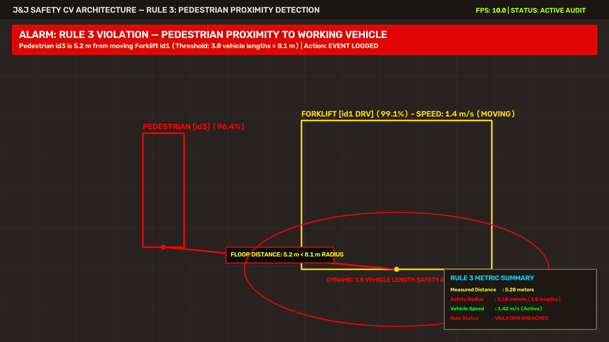

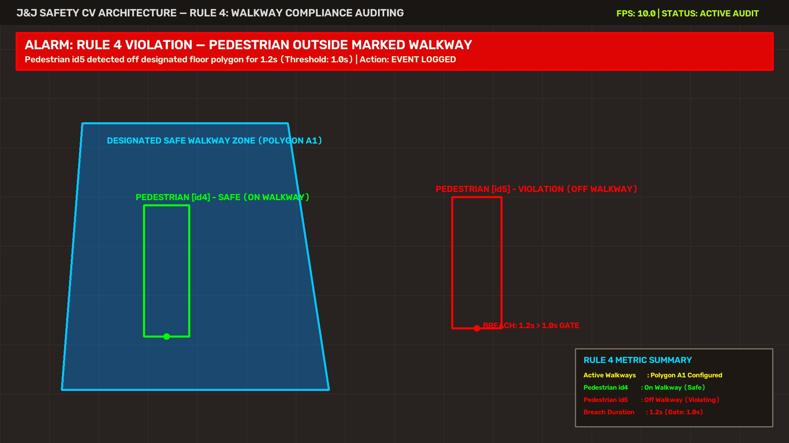

#### 4.2.4 Rule 5 (Driver Protrusion) and Rule 1 (Distraction)
- **Rule 5:** Evaluates whether driver skeletal keypoints protrude outside an inset cab boundary (15% horizontal inset, 35% top inset). In Figure 4.6, wrists extending outside the cab for 1.5 seconds trigger an alert.
- **Rule 1:** Measures wrist-to-head distance normalized by shoulder width. In Figure 4.7, a ratio of 0.38 sustained for 2.2 seconds triggers a distraction event.

#### 4.2.5 Pose Estimation Validation
RTMPose was evaluated across synthetic ceiling camera views, extracting valid keypoints across standing, walking, and crouching subjects (Table 4.2, Figure 4.8).

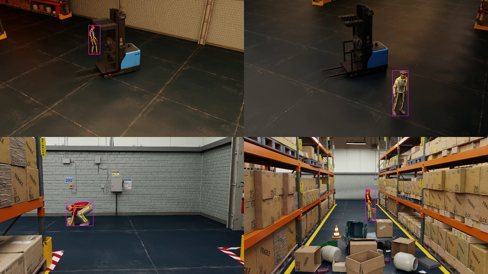

**Table 4.2: Pose Estimation Keypoint Extraction Results**

| Scene | Person Height | Valid Keypoints |
|-------|-------------|-----------------|
| nearmiss ceiling_00, standing | 228 px | 17 / 17 |
| nearmiss ceiling_00, walking | 356 px | 17 / 17 |
| box_pickup cam_00, crouching | 190 px | 14 / 17 |
| box_pickup cam_04, standing | 251 px | 17 / 17 |

### 4.3 Quantitative Rule Evaluation

#### 4.3.1 Rule 3 Performance
Rule 3 was evaluated on 178 synthetic simulator clips using both ground-truth bounding boxes and end-to-end detector outputs:

**Table 4.3: Rule 3 Evaluation Results (178 Synthetic Clips)**

| Detector Configuration | TP | FP | FN | Precision | Recall |
|----------------------|-----|-----|-----|-----------|--------|
| Perfect (ground-truth boxes) | 44 | 0 | 0 | 1.000 | 1.000 |
| RF-DETR v1, end-to-end | 178 | 0 | 0 | 1.000 | 1.000 |
| RF-DETR v2, end-to-end | 178 | 0 | 0 | 1.000 | 1.000 |

The ground-truth run isolates rule logic from perception error, confirming that geometric distance evaluation and driver association operate correctly.

#### 4.3.2 Rule 5 Scenario Matrix
Rule 5 was validated against a 7-scenario geometric test matrix (`tests/test_rule5_scenarios.py`):

**Table 4.4: Rule 5 Scenario Matrix Results**

| Scenario | Expected | Result |
|----------|----------|--------|
| Arm only outside cab | Fires | Pass |
| Torso outside cab | Fires | Pass |
| Head outside while reversing | Fires | Pass |
| Head-turn, head inside cab | Silent | Pass |
| Normal seated driving | Silent | Pass |
| Brief reach for a control | Silent | Pass |
| Occluded low-confidence joints | Silent | Pass |

All 7 scenarios passed, confirming that cab boundary tests and temporal duration filtering function as designed.

### 4.4 Technical Discussion and Limitations

#### 4.4.1 Advantages of Floor-Plane Projection
Projecting bounding boxes to the ground plane resolves perspective ambiguity where background pedestrians overlap foreground vehicles in 2D pixel space. By computing Euclidean distances in calibrated floor meters, the system prevents false proximity alarms caused by camera perspective.

#### 4.4.2 The Seated-Driver Detection Gap
Targeted validation on 16 real-world CCTV images with clearly visible seated drivers revealed a critical failure mode: the fine-tuned detector identified zero seated drivers.

**Table 4.5: Seated Driver Detection Gap**

| Model | Drivers Detected (out of 16) |
|-------|------------------------------|
| COCO-pretrained RF-DETR | 5 |
| Fine-tuned RF-DETR (mAP50:95 = 0.820) | 0 |

This issue stems from labeling gaps in source datasets, where standing pedestrians were annotated but seated vehicle operators were omitted. During fine-tuning, the detector learned to treat seated drivers as background. While an ROI crop-and-pose fallback was implemented to run RTMPose directly on forklift bounding boxes, closing this gap in production requires re-annotating training data to explicitly label seated operators.

#### 4.4.3 Occlusion and Conservative Decision Boundaries
Warehouse racking and freight regularly occlude workers. To maintain high precision, the system requires keypoint confidence $\ge 0.50$; occluded or low-confidence keypoints default to a non-violation state rather than risking false alarms.

#### 4.4.4 Scope Limitations
- **Rule 2:** Descoping was confirmed because inspection documentation cannot be verified from overhead cameras.
- **Rule 3 Signaled Recognition:** Visual detection of driver-pedestrian eye contact or hand signaling is beyond monocular camera capabilities; flagged proximity events require human audit.
- **Vehicle Dimensions:** Distance calculations use a 2.7-meter baseline vehicle length pending site-specific equipment measurements.

### 4.5 Operational Impact and Deployment

#### 4.5.1 Transition to Proactive Safety
Traditional EHS workflows rely on lagging indicators (post-incident reports). Continuous metric distance tracking generates near-miss frequency logs, enabling safety managers to identify high-risk intersections and pathway congestion before injuries occur.

#### 4.5.2 Edge Deployment Feasibility
Executing permissively-licensed ONNX models enables localized inference at the camera or edge appliance. Performing detection, tracking, and deterministic rule evaluation locally eliminates heavy cloud bandwidth overhead while preserving worker privacy through on-device face anonymization.

---

## Chapter 5. Conclusions and Future Work

### 5.1 Project Summary

This capstone project evaluated the feasibility of leveraging existing warehouse CCTV infrastructure to enable proactive safety monitoring for Johnson & Johnson. The objective was to determine whether computer vision could detect early warning signs of unsafe interactions, converting unstructured video streams into structured, auditable safety event logs for downstream EHS analysis.

The investigation focused on forklift and pedestrian interactions, organizing target behaviors around J&J’s Life-Saving Rules:
- **Rule 1 (Distraction):** Developed an exploratory proxy using normalized wrist-to-head distance.
- **Rule 2 (Pre-Use Inspection):** Descoped because verifying physical inspection logs is not reliably achievable from overhead video.
- **Rule 3 (Proximity):** Built and quantitatively validated floor-plane metric separation tracking between moving vehicles and pedestrians.
- **Rule 4 (Walkway Compliance):** Implemented geometric polygon containment tests for designated pedestrian corridors.
- **Rule 5 (Driver Body Protrusion):** Designed pose-based cab boundary checks to detect extending limbs.
- **Vehicle Motion:** Implemented calibrated ground-speed tracking in meters per second, providing the foundation for future overspeed rules.

Because proprietary J&J facility video was subject to data-governance and confidentiality restrictions, the prototype was developed and evaluated using public warehouse CCTV datasets and synthetic warehouse simulations. The completed pipeline produces annotated demonstration videos, face-anonymized evidence frames, and machine-readable JSON Lines event records. A comprehensive test suite with 91 automated unit and scenario tests verifies coordinate transformations, tracking hysteresis, and rule edge cases.

### 5.2 Major Contributions

1. **Translating Policy into Measurable Spatial Logic:** Rather than training opaque end-to-end classifiers to categorize frames as "safe" or "unsafe," the pipeline formalizes safety rules as explicit geometric, physical, and temporal conditions. This ensures that every alert is explainable, verifiable, and adjustable without model retraining.
2. **Unified, Reusable Perception Architecture:** A single perception stack (RF-DETR, ByteTrack, and RTMPose) serves all downstream rules simultaneously. This modularity avoids redundant inference passes and provides a clean foundation for extending the rule set.
3. **Planar Homography for Physical Reasoning:** Projecting bounding boxes to calibrated floor-plane coordinates eliminates 2D perspective distortions, enabling accurate metric distance and speed calculations.
4. **Transparent Failure Mode Identification:** Targeted validation revealed a critical seated-driver detection gap (0/16 detections in fine-tuned models) caused by missing labels in public training datasets. Surfacing this limitation highlights the necessity of multi-tier, scenario-specific testing over aggregate mAP benchmarks alone.

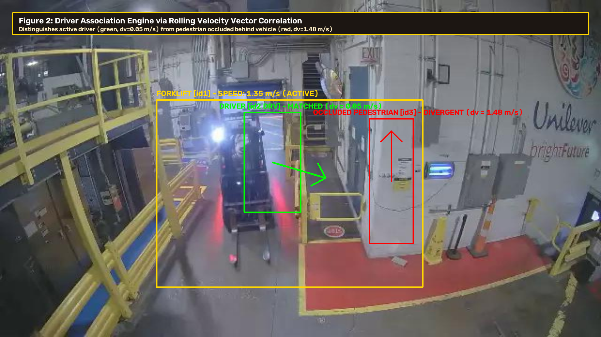

### 5.3 Lessons Learned

- **Visual Observation vs. Policy Semantics:** Overhead cameras capture physical quantities—bounding boxes, velocities, and skeletal keypoints—but cannot verify operational intent. For example, proximity detection measures metric distance but cannot determine whether a pedestrian and driver exchanged an audible or visual acknowledgment. System outputs must be treated as auditable indicators rather than definitive policy judgments.
- **Limitations of Aggregate Accuracy Metrics:** High benchmark performance (e.g., 0.820 mAP50:95) can obscure catastrophic failures on specific operational edge cases. Multi-tiered testing—spanning coordinate unit tests, synthetic scenario matrices, and targeted qualitative audits—is critical for safety-critical systems.
- **Real-World Engineering Constraints:** Practical deployment depends heavily on factors outside model accuracy, including open-source licensing compliance (favoring Apache-2.0 over AGPL-3.0), privacy preservation (automatic face anonymization), and compute efficiency on edge hardware.

### 5.4 Limitations

1. **Lack of On-Site J&J Validation:** Due to confidentiality and access constraints, evaluation was conducted on public and synthetic data. Performance on specific J&J warehouse layouts, camera mountings, and equipment types remains to be validated.
2. **Seated-Driver Detection Gap:** The fine-tuned detector struggles to identify seated forklift operators, limiting end-to-end evaluation of Rule 5 on real footage without manual annotations.
3. **Monocular Vision Assumptions:** The pipeline assumes fixed camera positioning and planar warehouse floors. Camera vibration, lens distortion, and severe occlusions by racking or pallets can interrupt tracking and coordinate projection.
4. **Heuristic Proxies:** Posture-based rules serve as indicators rather than definitive proof (e.g., wrist-near-head posture flags potential distraction but cannot confirm phone use).

### 5.5 Recommendations

1. **Conduct On-Site Facility Validation:** Ingest representative J&J footage to calibrate camera homographies, verify lighting and occlusion conditions, and benchmark detection accuracy on actual facility vehicles.
2. **Curate Scenario-Specific Training Data:** Re-annotate warehouse training datasets to explicitly include seated forklift operators, high-visibility vest variations, and diverse camera vantage points to resolve the Rule 5 detection bottleneck.
3. **Prioritize Proximity and Speed Rules for Pilot Deployment:** Begin pilot testing with Rule 3 (proximity) and the calibrated forklift speed module, as these offer the highest quantitative reliability and address J&J’s primary operational priorities.
4. **Enhance Occlusion Robustness for Pose Rules:** Incorporate multi-frame temporal smoothing and occlusion-aware keypoint filtering before expanding ergonomic rule complexity.

### 5.6 Future Work

- **Near-Term:** Perform site-specific camera calibration and run the pipeline on recorded J&J facility pilot footage. Re-train RF-DETR with explicit seated-driver annotations to operationalize Rule 5.
- **Medium-Term:** Formalize the motion layer into a configurable sustained speed-limit rule with localized zone configurations. Integrate multi-camera handoff logic to maintain object tracking across wide warehouse aisles.
- **Long-Term:** Transition the standalone containerized prototype into an edge-deployed, multi-stream safety assistance platform integrated with enterprise EHS reporting dashboards.

